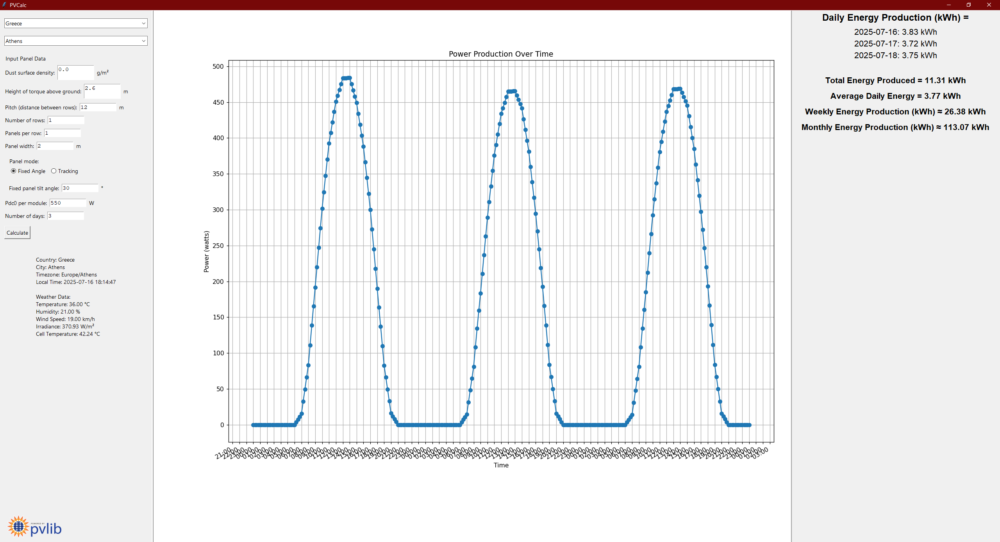
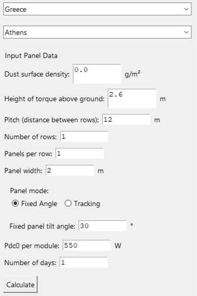
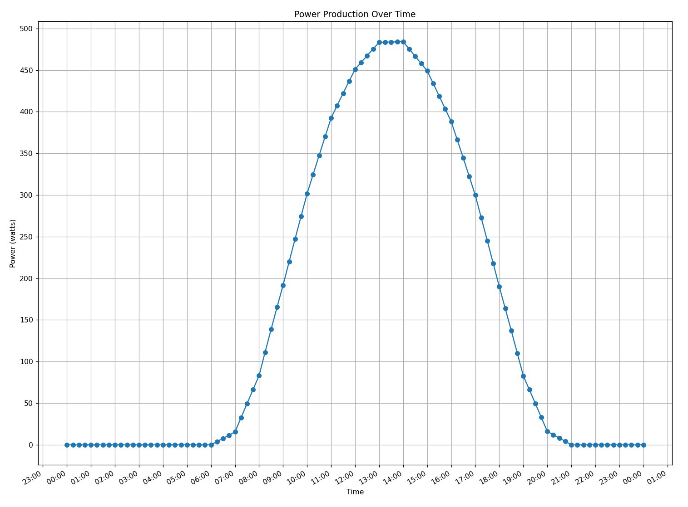
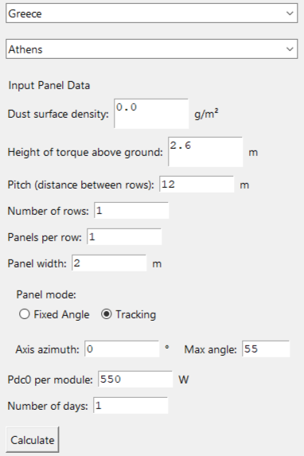
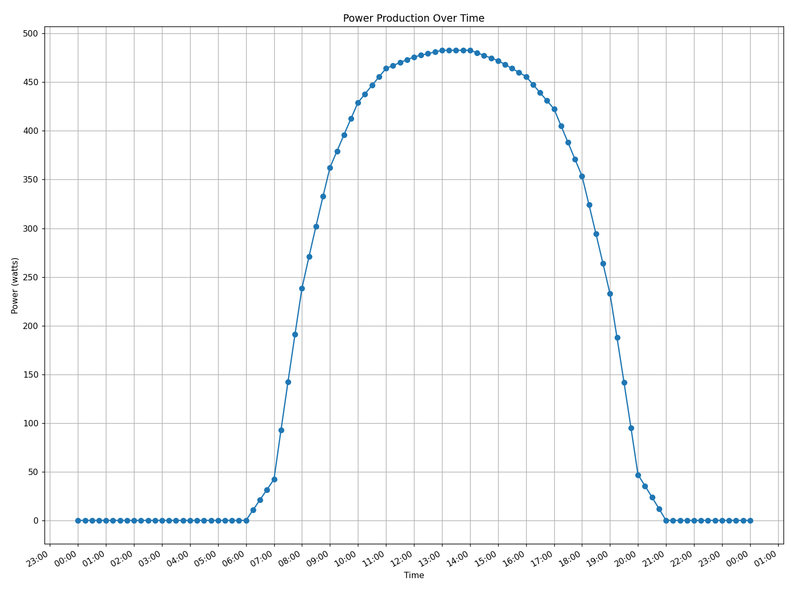
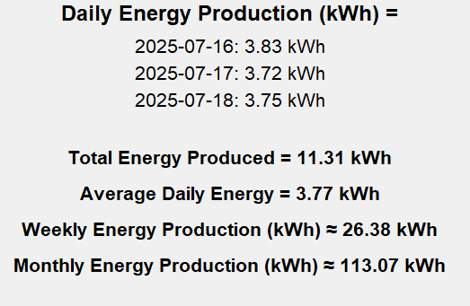
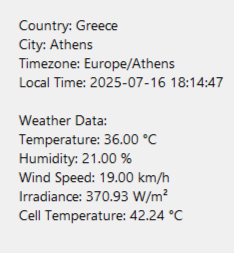

# PVCalc

PVCalc is a Python application that analyzes and calculates solar energy potential production based on forecast data from geographical inputs. It integrates various data sources and uses the `pvlib` Python library for solar irradiance modeling.

---

## Features

- Retrieve and display weather data for selected locations worldwide.
- Calculate solar irradiance and other relevant solar energy metrics.
- Support for dust surface density input to refine calculations.
- Interactive GUI built with Tkinter.
- Data sourced from reputable datasets on world cities and population density.
- Power production visualization for selected time periods.

---

## Installation

Before running the application from source make sure you have python 3.8+ installed, if not you can install python from [Python Download](https://www.python.org/downloads/).

1.Clone the repository
```bash
git clone https://github.com/spyridouladev/SolarECA.git
cd SolarECA
```
2.Create and activate virtual enviroment (not necessary but recommended)
```bash
python -m venv venv
source venv/bin/activate      # On Linux/macOS
venv\Scripts\activate.bat     # On Windows
```
3.Install dependencies
```bash
pip install -r requirements.txt
```
4.Run the application
```bash
python main.py
```
---
## Usage

First, input the data for the PV farm you want to calculate for.  
Keep in mind that the weather data is based on forecasts, so it will not be 100% accurate.

### Example: 3-Day Power Production

<div align="center">
  
</div>

---

### Fixed Angle Mode

You can choose between **fixed angle** and **single-axis tracker**.

**Fixed angle input interface:**

<div align="center">
  
</div>

**Graph for fixed angle:**

<div align="center">
  
</div>

---

### Single-Axis Tracker Mode

**Tracking input interface:**

<div align="center">
  
</div>

**Graph for tracking:**

<div align="center">
  
</div>

---

### Results and Forecast

**Estimated production (⚠️ Not precise due to limited forecast data):**

<div align="center">
  
</div>

**Live weather data display beneath input fields:**

<div align="center">
  
</div>

## Attribution and License

### Cell Temperature model
This project incorporates concepts and correlation models derived from:

> Gholami, A., Ameri, M., Zandi, M., Gavagsaz Ghoachani, R., Jafarzadegan Gerashi, S., Kazem, H. A., & Al-Waeli, A. H. A. (2023). *Impact of harsh weather conditions on solar photovoltaic cell temperature: Experimental analysis and thermal-optical modeling*. Solar Energy, 252, 176–194. https://doi.org/10.1016/j.solener.2023.01.039

### Data Sources (licensed under CC BY 4.0)

- **Basic World Cities Database** by SimpleMaps, licensed under [Creative Commons Attribution 4.0 (CC BY 4.0)](https://creativecommons.org/licenses/by/4.0/). Source: [https://simplemaps.com/data/world-cities](https://simplemaps.com/data/world-cities)  
- **Population density data** from *The Center for International Earth Science Information Network (CIESIN), Columbia University*, licensed under [CC BY 4.0](https://creativecommons.org/licenses/by/4.0/). Source: [Gridded Population of the World, Version 4 (GPWv4)](http://dx.doi.org/10.7927/H4X63JVC)

Please review these licenses for detailed terms and attribution requirements.

---

### Software Library (licensed under BSD 3-Clause)

This project uses **pvlib python**, licensed under the BSD 3-Clause License. The copyright and license notice for pvlib are included with this project.

